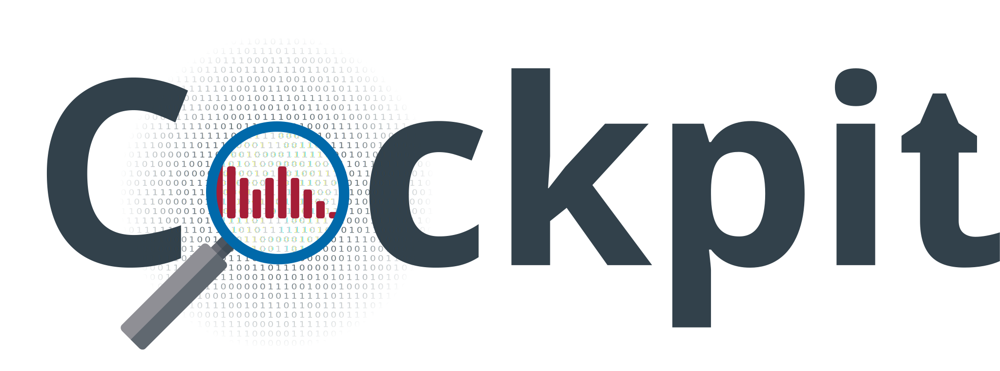

<!-- PROJECT LOGO -->
<br />
<p align="center">
<a href="#"></a>
  <h3 align="center">A Practical Debugging Tool for Training Deep Neural Networks</h3>

  <p align="center">
    A better status screen for deep learning.
  </p>
</p>

<p align="center">
  <a href="#installation">Installation</a> •
  <a href="https://cockpit.readthedocs.io/">Docs</a> •
  <a href="https://github.com/fsschneider/cockpit-experiments">Experiments</a> •
  <a href="#license">License</a> •
  <a href="#citation">Citation</a>
</p>

[](https://github.com/f-dangel/cockpit/actions/workflows/CI.yml)
[](https://github.com/f-dangel/cockpit/actions/workflows/Lint.yml)
[](https://cockpit.readthedocs.io)
[](https://coveralls.io/github/f-dangel/cockpit?branch=main)
[](https://github.com/f-dangel/cockpit/blob/master/LICENSE)
[](https://github.com/psf/black)
[](https://arxiv.org/abs/2102.06604)

---

```bash
pip install cockpit-for-pytorch
```

---

**Cockpit is a visual and statistical debugger specifically designed for deep learning.** Training a deep neural network is often a pain! Successfully training such a network usually requires either years of intuition or expensive parameter searches involving lots of trial and error. Traditional debuggers provide only limited help: They can find *syntactical errors* but not *training bugs* such as ill-chosen learning rates. **Cockpit** offers a closer, more meaningful look into the training process with multiple well-chosen *instruments*.

---


<!-- Installation -->
## Installation

To install **Cockpit** simply run

```bash
pip install cockpit-for-pytorch
```

<details>
<summary>Conda environment</summary>
For convenience, we also provide a conda environment, which can be installed via the conda yml file. It includes all the necessary requirements to build the docs, execute the tests and run the examples.
</details>

<!-- Documentation -->
## Documentation

The [documentation](https://cockpit.readthedocs.io/) provides a full tutorial on how to get started using **Cockpit** as well as a detailed documentation of its API.

<!-- Experiments -->
## Experiments

To showcase the capabilities of **Cockpit** we performed several experiments illustrating the usefulness of our debugging tool. The code for the experiments can be found in a [separate repository](https://github.com/fsschneider/cockpit-experiments). For a discussion of those experiments please refer to our [paper](https://arxiv.org/abs/2102.06604).

<!-- LICENSE -->
## License

Distributed under the MIT License. See [`LICENSE`](LICENSE.txt) for more information.

<!-- Citation -->
## Citation

We are interested in successful user stories with **Cockpit** (shoot us an email!).

Please consider citing:

> [Frank Schneider, Felix Dangel, Philipp Hennig<br/>
> **Cockpit: A Practical Debugging Tool for Training Deep Neural Networks**<br/>
> *arXiv 2102.06604*](http://arxiv.org/abs/2102.06604)

```bibtex

@inproceedings{schneider2021cockpit,
  author =       {Schneider, Frank and Dangel, Felix and Hennig, Philipp},
  booktitle =    {Advances in Neural Information Processing Systems},
  editor =       {M. Ranzato and A. Beygelzimer and Y. Dauphin and P.S. Liang
                  and J. Wortman Vaughan},
  pages =        {20825--20837},
  publisher =    {Curran Associates, Inc.},
  title =        {Cockpit: A Practical Debugging Tool for the Training of Deep
                  Neural Networks},
  url =
  {https://proceedings.neurips.cc/paper/2021/file/ae3539867aaeec609a4260c6feb725f4-Paper.pdf},
  volume =       34,
  year =         2021
}

```
