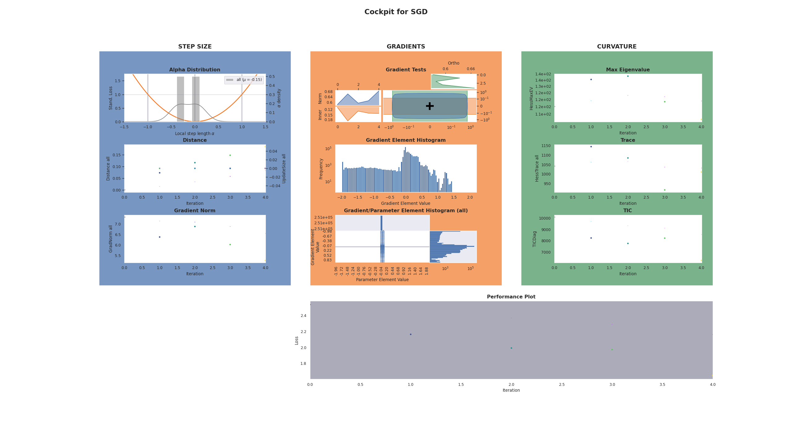

.. _basic_example:

=============
Basic Example
=============

This snippet below shows an example of using **Cockpit** with a standard PyTorch 
training loop.
Lines that are highlighted in yellow highlight **Cockpit**-specific code, but 
don't worry, most of these changes are simple plug-and-play solutions.

You can try out this basic example yourself.
Simply install **Cockpit** via

.. code:: bash

  pip install 'git+https://github.com/f-dangel/cockpit.git'

and then copy the `example files <https://github.com/f-dangel/cockpit/tree/main/examples>`_
from the repository or from the code block below. 

.. note::

  Don't forget the :download:`utility file <../../../examples/_utils_examples.py>` 
  which provides the data for this example.

.. literalinclude:: ../../../examples/01_basic_fmnist.py
   :language: python
   :emphasize-lines: 4-5, 7-8, 12-14, 20-21, 31, 34-43, 51, 56
   :linenos:

Try running this :download:`example script <../../../examples/01_basic_fmnist.py>`  
via

.. code:: bash

  python 01_basic_fmnist.py

During every iteration of the training process, **Cockpit** will show you a 
status screen of the training.

.. code-block:: console

  $ python 01_basic_fmnist.py
  
  Step:     1 | Loss: 2.5365
  [cockpit|plot] Showing current Cockpit.
  Step:     2 | Loss: 2.1643
  [cockpit|plot] Showing current Cockpit.
  Step:     3 | Loss: 1.9929
  [cockpit|plot] Showing current Cockpit.
  Step:     4 | Loss: 1.9733
  [cockpit|plot] Showing current Cockpit.
  Step:     5 | Loss: 1.6479
  [cockpit|plot] Showing current Cockpit.
  [cockpit|plot] Showing current Cockpit. Blocking. Close plot to continue.

which will look something like this

In the following, we will break-down and explain each step of this exampe, which
also explains what is required to include **Cockpit** to a training loop.

Imports
=======

.. literalinclude:: ../../../examples/01_basic_fmnist.py
   :language: python
   :emphasize-lines: 4-5,7-8
   :linenos:
   :lines: 1-8

Additionally to importing PyTorch, we import BackPACK which will automatically 
be installed when installing **Cockpit**. We also import the :class:`~cockpit.Cockpit` 
and :class:`~cockpit.CockpitPlotter` class which will let us track and then 
visualize insightful quantities.

To simplify the code snippet, in line 4, we import from a utils file which will 
provide us with the Fashion-MNIST data.

Defining the Problem
====================

.. literalinclude:: ../../../examples/01_basic_fmnist.py
   :language: python
   :emphasize-lines: 3-5
   :linenos:
   :lines: 10-14
   :lineno-start: 10

Next, we build a simple classifier for our Fashion-MNIST data set.

The only change to a traditional training loop is that we need to 
`extend <https://docs.backpack.pt/en/master/main-api.html#how-to-use-backpack>`_ 
both the model and the loss function using BackPACK.
This is as simple as wrapping the traditional model and loss function in the 
``extend()`` function provided by BackPACK.
It lets BackPACK know that additional quantities (such as individual gradients) 
should be computed for these parameters.

For the :class:`~cockpit.quantities.Alpha` quantity we also require access to 
the individual loss values, which can be computed cheaply but is not usually 
part of a conventional training loop.
We can create this function analogously to the regular loss function just setting 
the ``reduction=None``.
There is no need to let BackPACK know about its existence, since these losses 
will not be differentiated.

Configuring the Cockpit
=======================

.. literalinclude:: ../../../examples/01_basic_fmnist.py
   :language: python
   :emphasize-lines: 2-3
   :linenos:
   :lines: 19-21
   :lineno-start: 19

Computation of the quantities and storing of the results are managed by the 
:class:`~cockpit.Cockpit` class. We have to pass the model parameters, and a 
list of quantities, which specify what should be tracked and when.

Cockpit offers configurations with different computational complexity: 
``"economy"``, ``"business"``, and ``"full"`` (see also 
:func:`~cockpit.utils.configuration.configuration`). We will use the provided 
utility function to track all possible quantities.

Training Loop
=============

.. literalinclude:: ../../../examples/01_basic_fmnist.py
   :language: python
   :emphasize-lines: 9-18
   :linenos:
   :lines: 26-43
   :lineno-start: 26

Training itself is straightforward. At every iteration, we draw a mini-batch, 
compute the model predictions and losses, then perform a backward pass and update 
the parameters.

The main differences with **Cockpit** is that the backward call is surrounded by 
a ``with cockpit(...)`` context, that manages the extra computations during the 
backward pass. Additional information required by some quantities is passed 
through the ``info`` argument.

Plotting the Cockpit
====================

.. literalinclude:: ../../../examples/01_basic_fmnist.py
   :language: python
   :emphasize-lines: 3
   :linenos:
   :lines: 49-51
   :lineno-start: 49

At any point during the training, here we do it in every single iteration, the 
computed metrics can be visualized by calling the plotting functionality of the 
:class:`~cockpit.CockpitPlotter` via :func:`~cockpit.CockpitPlotter.plot()`.

.. literalinclude:: ../../../examples/01_basic_fmnist.py
   :language: python
   :emphasize-lines: 4
   :linenos:
   :lines: 53-56
   :lineno-start: 53

After the final iteration, we will again show the full **Cockpit** view. The option
``block=True`` allows us to pause our program and inspect the plot for as long as
we want.
The final **Cockpit** status screen will look similar to this:

Simply closing the plotting window ends the program and this example.