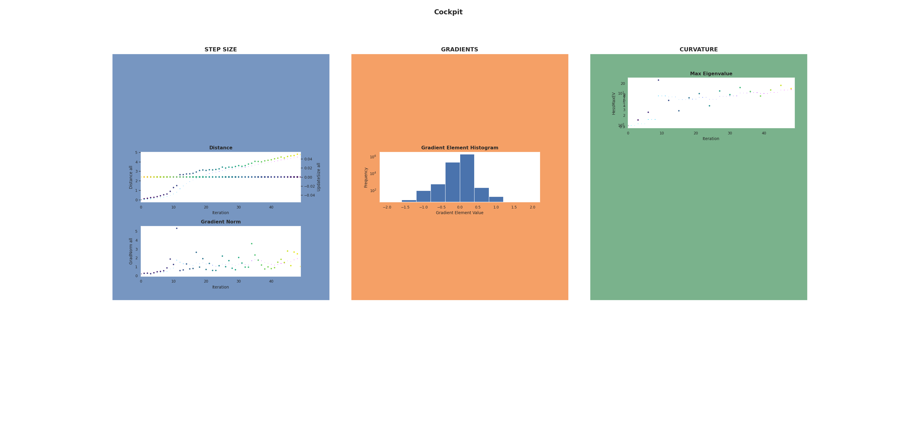

================
Advanced Example
================

In this second example, we will take a look into a couple more advanced features
and ways to customize **Cockpit**.

.. note::

  Just like before, you also need the :download:`utility file 
  <../../../examples/_utils_examples.py>` 
  which provides us with the training data, a convolutional network and a logpath.
  You can copy all `example files 
  <https://github.com/f-dangel/cockpit/tree/development/examples>`_ from our 
  repository.

.. literalinclude:: ../../../examples/02_advanced_fmnist.py
   :language: python
   :linenos:
   :emphasize-lines: 12,19-28,44,60-67,72-73,75-82

To run :download:`this example script <../../../examples/02_advanced_fmnist.py>`, 
run 

.. code:: bash

  python 02_advanced_fmnist.py

This time no **Cockpit**-plot will show. Instead, the plots will be directly saved
to files. Everything that the **Cockpit** tracked during training will also be stored
and both this *logfile* as well as the plots can be inspected and analyzed after 
training is finished.

.. code-block:: console

  $ python 02_advanced_fmnist.py
  
  Step:     1 | Loss: 2.2965
  Step:     2 | Loss: 2.3185
  Step:     3 | Loss: 2.2932
  Step:     4 | Loss: 2.2893
  Step:     5 | Loss: 2.2865
  Step:     6 | Loss: 2.2780
  Step:     7 | Loss: 2.2485
  Step:     8 | Loss: 2.2600
  Step:     9 | Loss: 2.1823
  Step:    10 | Loss: 2.0557
  [cockpit|plot] Saving figure in ~/logfiles/cockpit_output__primary10.png
  Step:    11 | Loss: 2.0539
  Step:    12 | Loss: 2.4792
  [...]

We will now go over the main changes compared to the :ref:`basic example <basic_example>`.
The relevant lines including the most important changes are highilghted above.

Network Architecture
====================

.. literalinclude:: ../../../examples/02_advanced_fmnist.py
   :language: python
   :linenos:
   :lines: 12
   :lineno-start: 12

In contrast to the basic example, we use a convolutional model architecture instead
of a dense network. For **Cockpit** this does not change anything! Just like before,
the network needs to be extended, which works in exactly the same way as before.

Customizing the Quantities
==========================

.. literalinclude:: ../../../examples/02_advanced_fmnist.py
   :language: python
   :linenos:
   :lines: 19-28
   :lineno-start: 19

**Cockpit** allows you to fully customize what and how often you want to track it.

Instead of using a pre-defined configuration, here, we customize our set of quantities.
We use five quantities, the :class:`~cockpit.quantities.GradNorm`, the 
:class:`~cockpit.quantities.Distance` and :class:`~cockpit.quantities.UpdateSize`, 
the :class:`~cockpit.quantities.HessMaxEV` and the 
:class:`~cockpit.quantities.GradHist1d`. For each quantity we use a different
rate of tracking, e.g., we track the distance and update size in every step, but
the largest eigenvalue of the Hessian only every third step. 
We further customize the gradient histogram
by specifying that we only want to use 10 different ``bins``.

Additional BackPACK Extensions
==============================

.. literalinclude:: ../../../examples/02_advanced_fmnist.py
   :language: python
   :linenos:
   :lines: 44
   :lineno-start: 44

**Cockpit** uses BackPACK for most of the background computations to extract more
information from a single backward pass. If you want to use additional BackPACK
extensions you can just pass them using the ``with cockpit()`` context.

Plotting Options
================

.. literalinclude:: ../../../examples/02_advanced_fmnist.py
   :language: python
   :linenos:
   :lines: 60-82
   :lineno-start: 60

In this example, we now create a **Cockpit** view every tenth iteration. 
Instead of showing it in real-time, however, we directly save to disk.
At the end of the training process, we write all **Cockpit** information to a log
file. We can then also plot from this file, which we do in the last step.

Writing and then plotting from a log file allows **Cockpit** to not only be used
as a real-time diagnostic tool, but also to examine experiments later or compare
multiple runs by contrasting their **Cockpit** views.

The final **Cockpit** plot gets also saved and will look similar to the below image.
You can see that the :class:`~cockpit.CockpitPlotter` only shows the 
:ref:`instruments <instruments>` where the corresponding :ref:`quantities <quantities>`
have been tracked.

