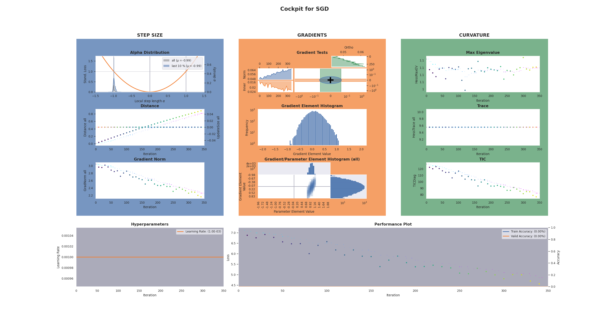

===============
DeepOBS Example
===============

**Cockpit** easily integrates with and can be used together with 
`DeepOBS <https://deepobs.github.io/>`_.
This will directly give you access to dozens of deep learning problems 
that you can explore with **Cockpit**.

.. Note::
   This example requires a `DeepOBS <https://github.com/fsschneider/DeepOBS/>`__ 
   and a `BackOBS <https://github.com/f-dangel/backobs>`_ installation. 
   You can install them by running

   .. code:: bash

      pip install 'git+https://github.com/fsschneider/DeepOBS.git@develop#egg=deepobs'

   and
   
   .. code:: bash

      pip install 'git+https://github.com/f-dangel/backobs.git@master#egg=backobs'

   Note, that currently, only the 1.2.0 beta version of DeepOBS supports PyTorch
   which will be installed by the above command.

.. note::

  In the following example, we will use an additional :download:`utility file 
  <../../../examples/_utils_deepobs.py>` which automatically incorporates **Cockpit**
  with the DeepOBS training loop.

Having the two `utility files from our repository 
<https://github.com/f-dangel/cockpit/tree/development/examples>`_ we can run

.. code:: bash

  python 03_deepobs.py

which exectues the following file:

.. literalinclude:: ../../../examples/03_deepobs.py
   :language: python
   :linenos:

Just like before, we can define a list of quantities (here we use the 
:mod:`~cockpit.utils.configuration` ``"full"``) that we this time pass to the
``DeepOBSRunner``. It will automatically pass it on to the :class:`~cockpit.Cockpit`.

With the arguments of the ``runner.run()`` function, we can define whether we want
the :class:`~cockpit.CockpitPlotter` plots to show and/or be stored.

The **Cockpit** will show a status screen every few epochs, as well as writing to
a logfile and saving its final plot, after training completed.

.. code-block:: console

  $ python 03_deepobs.py

  ********************************
  Evaluating after 0 of 15 epochs...
  TRAIN: loss 7.0372
  VALID: loss 7.07626
  TEST: loss 7.06894
  ********************************
  [cockpit|plot] Showing current Cockpit.
  ********************************
  Evaluating after 1 of 15 epochs...
  TRAIN: loss 7.00634
  VALID: loss 7.01242
  TEST: loss 7.00535
  ********************************
  ********************************
  Evaluating after 2 of 15 epochs...
  TRAIN: loss 6.98335
  VALID: loss 6.94937
  TEST: loss 6.94255
  ********************************
  [cockpit|plot] Showing current Cockpit.
  
  [...]

The fifty epochs on the `deep quadratic 
<https://deepobs.readthedocs.io/en/v1.2.0-beta0_a/api/pytorch/testproblems/quadratic/quadratic_deep.html>`_ 
problem will result in a **Cockpit** plot similar to this:

